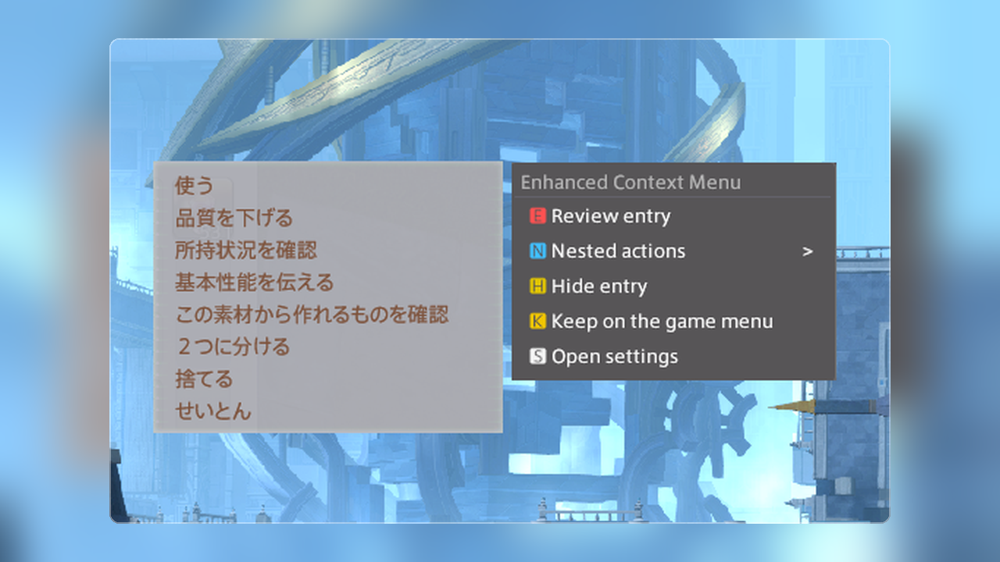

<p align="center">
  
</p>

<h1 align="center">Enhanced Context Menu</h1>

<p align="center">
  <a href="../README.md">English</a> | 日本語
</p>

<p align="center">
  <a href="https://github.com/exatrines/EnhancedContextMenu/releases/latest"></a>
  <a href="../CHANGELOG.md"></a>
  <a href="../LICENSE"></a>
</p>

<p align="center">
  
</p>

Enhanced Context Menu は、他のプラグインがコンテキストメニューに追加した項目をオーバーレイパネルに移します。コンテキストメニューを開くと、オーバーレイパネルが自動で表示されます。

ネイティブUIを直接書き換えて追加した項目は、ネイティブのコンテキストメニューに残るため、注意が必要です。

## インストール

1. `/xlsettings` を実行し、**試験的機能**タブを開く
2. **カスタムプラグインリポジトリ** に次の URL を追加する:

```
https://raw.githubusercontent.com/exatrines/DalamudPlugins/refs/heads/main/pluginmaster.json
```

3. `/xlplugins` を実行し、**Enhanced Context Menu** をインストールする

## 機能

- **オーバーレイパネル**：他のプラグインが追加したコンテキストメニュー項目を、ゲームメニューの横のパネルへ移す
- **ゲームパッド**：パネルをゲームパッドで操作する

## コマンド

| コマンド | 説明 |
| --- | --- |
| `/enhancedcontextmenu` | プラグイン設定画面の表示切替 |

## 開発者向け

1. `git submodule update --init --recursive`
2. `dotnet build EnhancedContextMenu.sln -c Release -p:Platform=x64`
3. Dalamud の **dev plugin** に `EnhancedContextMenu/bin/Release/` を指定する
4. プラグインインストーラ（dev）で **Enhanced Context Menu** を有効にする

共有UIキットの [MirageUI](https://github.com/exatrines/MirageUI) を git サブモジュールとして同梱しています。

## コントリビューション

コントリビューションは大歓迎です！[貢献ガイド](../CONTRIBUTING.md)をご覧ください。
